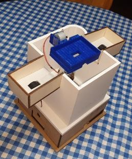
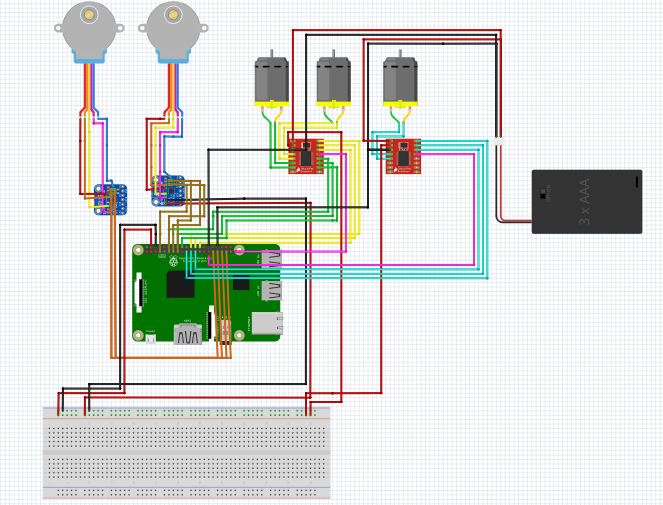
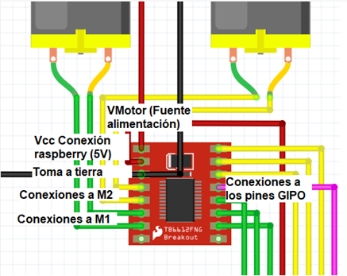
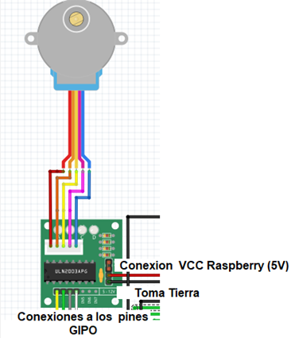
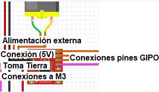
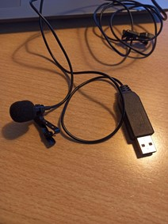
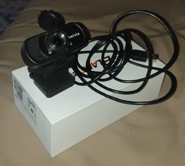
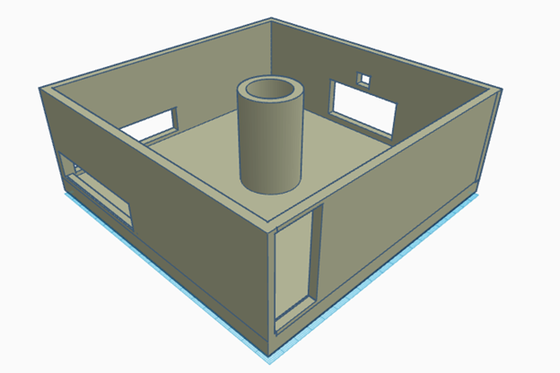
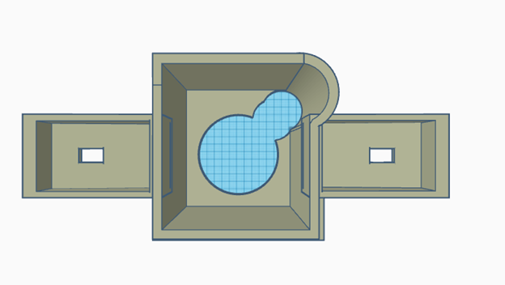
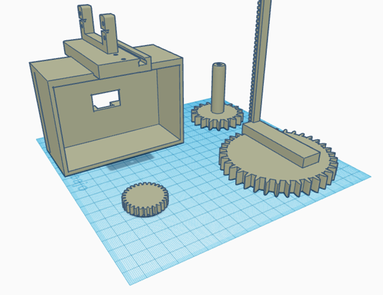

## Índice de contenidos
* [¿Qué es Shufflebot?](#Shufflebot)
* [Instalación de dependencias](#instalar)
* [Arquitectura HW](#HW)
* [Diseño de las piezas 3D](#Diseño3D)
* [Funcionamiento](#Funcionamineto)

# Shufflebot
Shufflebot, un robot conectado a la corriente que a través de una cámara, un micro y un altavoz será capaz de gestionar una partida de cartas e interactuar con los jugadores. 
Para llevar a cabo su cometido, el robot dispondrá de dos compartimentos donde se insertará la baraja completa dividida en dos mazos distintos para luego mezclarlos en uno solo. Una vez mezclada la baraja, el robot gira sobre sí mismo repartiendo el número de cartas deseado en función del modo de juego a todos los jugadores. Dichos jugadores se comprobarán previamente a través de la visión por computador. El robot no únicamente contabilizará el número, sino que también tendrá la función de reconocerlos. Se adaptarán diferentes funcionalidades como el robo de cartas en función de lo que cada modo requiera.

### Instalación de las dependencias
- RPi.GPIO(Version 0.7.1) :pip install RPi.GPIO
- opencv2(Version 4.0.0): pip install opencv-python (https://www.youtube.com/watch?v=QzVYnG-WaM4)
- numpy(Version: 1.20.3): pip install numpy

### Arquitectura HW

  
  **Mezcla de la baraja (2Motores DC + Controlador)**
   Para mezclar la baraja conectaremos dos motores dc al controlador de motores 1 que se alimentarán a través de una fuente de alimentación externa, a continuación podemos ver al detalle las conexiones de los motores con el controlador y la conexión con los pines de la Raspberry.
  

  
  La función de estos componentes es que los motores giren 2 rueditas y estas, situadas debajo de los dos montones de cartas, las empuje hacia dentro del robot creando un mismo montón.
  
  Pines GPIO utilizados: 23,4,12(M1) y 13,19,26(M2), 6(Controlador)
  
  **Reparto de cartas (Motores paso a paso + Motor DC + Controlador) **
  Mediante un sistema de elevación y rotación del cajón central haremos que las cartas se repartan a cada jugador. Concretamente utilizaremos un motor dc conectado a un controlador, dos motores,  paso a paso los cuales ya tiene su propio controlador, concretamente las conexiones són las siguientes.
Motores Paso a Paso:
    

  
Pines GPIO utilizados: 24,25,8,7;     17,27,22,4.
Motor DC + controlador:

    
Pines GPIO utilizados: 10,9,11 (M3), 18(controlador)
    
  **E/S de Audio**
  Nuestro robot en la fase final debería ser capaz de escuchar y entender ciertas órdenes y respondernos alguna cosa que indique que ha comprendido dichas órdenes. Para ello conectaremos un micro y un altavoz a la placa y a la raspberry, concretamente de la siguiente manera:
Micro: Conectado por USB
  
  

  

  **E/S de video**
    Cámara USB, utilizada en la parte de visión por computador del robot. Gracias a ella el robot será capaz de reconocer a las personas que se encuentran alrededor de la mesa. Estos datos se tendrán en cuenta posteriormente en la gestión de la partida.
    

## Diseño 3D

A continuación listamos las piezas 3D necesarias para crear la estructura de nuestro robot:

**Estructura inferior**

  
Esta pieza actuará como cajón donde meteremos todos los componentes hardware necesarios para que el robot funcione correctamente (raspberry, controladores de motores, amplificador, motor paso a paso, cableado…). También servirá como base ya que la estructura superior irá apoyada sobre este cajón.
  
**Estructura Superior**
  

  

  
 Esta pieza es la estructura principal del robot ya que aquí se colocaran los engranajes, motores+ruedas y será donde se mezclaran y se repartirán las cartas mediante el funcionamiento de todos los motores.
    
**Engranajes y repartidor**
  

  
Aquí se pueden ver las piezas siguientes:
  
Cajón repartidor: será el cajón que subirá, bajará y rotará para así poder repartir las cartas correctamente y es donde caerán las cartas al mezclarlas. También tiene una estructura diseñada para poder acoplar nuestro servomotor.
  
Engranaje grande con columna dentada: este será la base del cajón repartidor, está diseñado para que pueda rotar y a la vez se le pueda montar el cajón para que suba y baje.
  
Engranaje mediano: este irá directamente conectado al motor paso a paso y será el que impulsa todo el sistema de rotación.

### Robot montado

### Pinza

### Articulaciones del brazo

### Base del brazo

### Base de la carrocería

### Soporte de la caja

  
### Caja con corpantimentos

  
## Reconocimiento de objetos
Se ha utilizado el lenguaje Python para realizar el reconocimiento e identificación de formas, y se ha importado la librería “opencv” para obtener imágenes de la cámara. Y la librería “imageai” que utiliza “tensorflow”, una librería orientada a construir y entrenar redes neuronales, para utilizar un modelo de reconocimiento de objetos (Yolo).

Tras unas adaptaciones se ha utilizado el modelo para reconocer objetos en una simulación en CoppeliaSim.

Los datos de cada objeto se gestionan con Python como una lista de diccionarios.

## Simulación

Se ha simulado el comportamiento del robot con CoppeliaSim para recrear un espacio con una serie de diferentes objetos, que se interponen en el camino del robot. Éste, pudiendo detectarlos, recogerlos y almacenarlos en los compartimentos correspondientes, simula su correspondiente actuación. 

### Ruedas
Se han utilizado las siguientes ruedas para la simulación.

### Ruedas incorporadas en el stl de la caja

### Funcionamiento

El robot gira hasta detectar un objeto que le interesa.

Una vez detectado se acerca a él, lo recoge y lo almacena en el compartimento que le pertoque.

  El siguiente enlace contiene el video promocional de SweeperBot (https://youtu.be/OWggp3zetLo)

